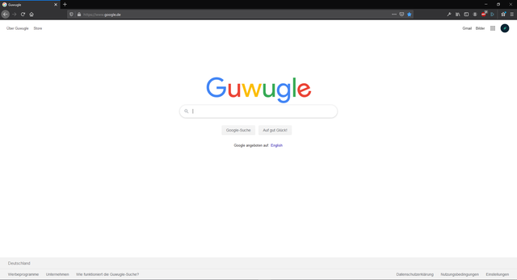

      
  <h1 align="center">
    Guwugle
  </h1>

<h3 align="center">
  Replace the Google Logo with one that says "Guwugle"
   
  <a href="https://addons.mozilla.org/de/firefox/addon/guwugle/">Download on Mozilla</a>
</h3>

    

